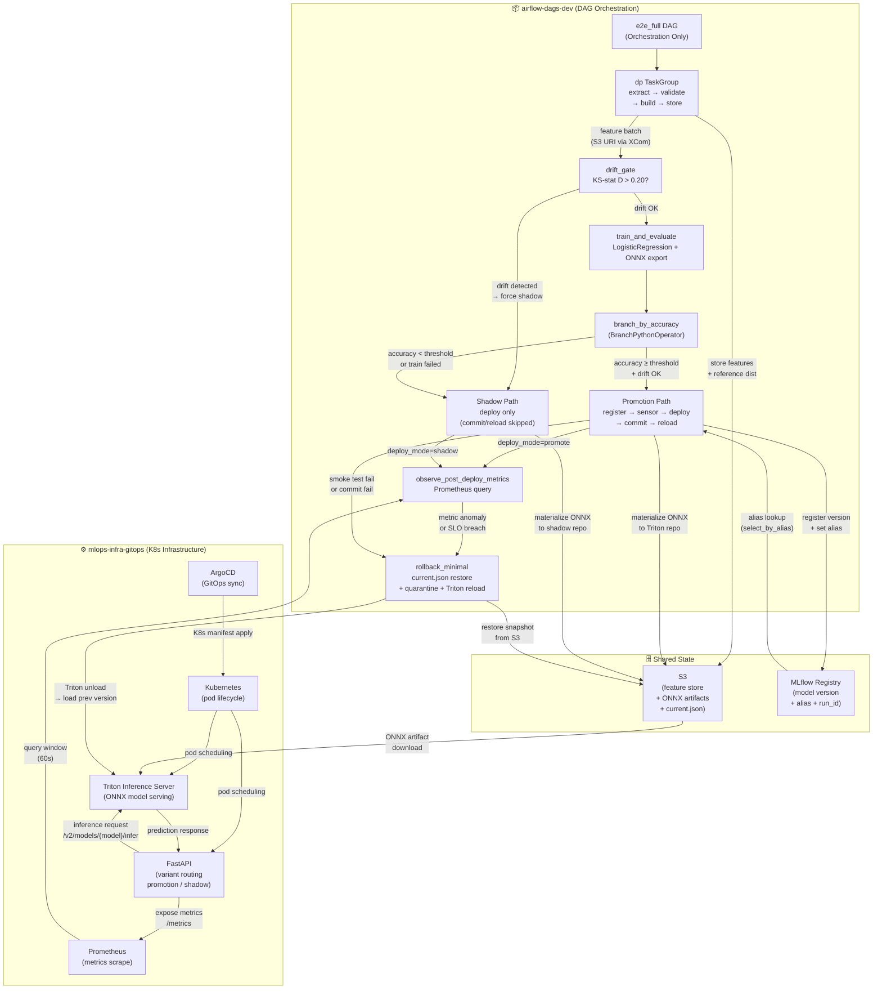

# GitOps 기반 Production-Grade E2E ML Platform

이 프로젝트는 모델을 단순히 배포하는 것이 아니라,

> 모델 교체를 운영 환경에서 안전하게 수행하기 위한 ML Platform

을 목표로 설계되었습니다.

---

# 0. System Architecture

두 레포(`airflow-dags-dev` + `mlops-infra-gitops`)가 협력하여 구성하는 전체 시스템입니다.



> **레포 역할 분리**: `airflow-dags-dev`는 파이프라인 로직과 배포 정책을 소유합니다.
> `mlops-infra-gitops`는 인프라 선언(Helm values, K8s manifests)을 소유합니다.
> 두 레포는 S3 / MLflow Registry / Triton HTTP API를 통해서만 결합됩니다.

---

# 1. What Problem This Solves

운영 환경에서 모델 교체는 다음과 같은 리스크를 가집니다:

- 정확도 저하
- 데이터 분포 변화
- 잘못된 모델 로딩
- 배포 실패 후 불완전 상태
- 과잉 롤백

이 플랫폼은 이러한 리스크를 통제하기 위해 다음을 구현합니다:

- Accuracy + Drift Gate 기반 Promotion / Shadow 분기
- Drift Gate 사전 차단
- Sensor 기반 Ready 검증
- Smoke Test 기반 배포 검증
- Minimal Rollback 정책
- SSOT 설계로 변경 안전성 확보

---

# 2. Core Design Decisions

## 2.1 Orchestration-Only DAG

`dags/e2e_full.py`는 오직 의존성 그래프만 정의합니다.

비즈니스 로직은:

- `pipelines/*`
- `ml_code/*`

로 완전 분리.

→ DAG 수정 시 영향 범위 최소화  
→ 유지보수 안전성 확보  

---

## 2.2 SSOT (Single Source of Truth)

모든 식별자/정책은 중앙 정의:

- `mlops_lib/core/ids.py`
- `mlops_lib/core/policy.py`

목적:

- 문자열 하드코딩 제거
- TaskGroup prefix mismatch 방지
- rename/refactor 안전성 확보
- 운영 사고 방지

---

## 2.3 Promotion / Shadow 전략

Accuracy + Drift Gate 기반 분기:

- accuracy ≥ threshold → Promotion
- accuracy < threshold → Shadow
- train 실패 → Shadow
- drift 감지 → 강제 Shadow

운영 모델은 Promotion이 아닌 이상 변경되지 않습니다.

---

## 2.4 Minimal Rollback 원칙

Rollback은 다음만 수행합니다:

- Triton repository snapshot 복구
- current.json 복원
- 실패 디렉토리 격리

하지 않는 것:

- FastAPI reload 실패 시 repo rollback

이유:

> Repository SSOT를 되돌리는 것이 reload 실패보다 더 위험하기 때문입니다.

---

# 3. End-to-End Flow
```
Data → Feature → Train → Branch
↓
(Promotion) → Register → Ready Sensor → Deploy → Smoke → Commit → Reload → Observe
↓
(Shadow) → Deploy(shadow) → Observe
↓
Failure → Minimal Rollback
```


---

# 4. Observability & Auto Rollback

배포 후:

- Prometheus 기반 metric 수집
- AutoRollback 정책 평가
- 임계값 초과 시 Airflow task 실패
- DAG trigger_rule=ONE_FAILED로 rollback 실행

> 관측 실패는 무조건 롤백이 아니라, 정책 기반 판단 결과에 따라 롤백

---

# 5. Stability Proof

- Airflow Import Error 0
- Promotion / Shadow 분기 정상 동작
- Sensor 기반 Ready 확인
- Smoke Test 실패 시 rollback 정상 실행
- SSOT 기반 task_id 안정성 확보

---

---

# 6. Impact

> 실제 운영 데이터가 없는 환경에서는 설계 목표(SLO) 및 로컬 1-replica 시뮬레이션 측정값을 기준으로 기재합니다.
> 면접 질문 "이 수치가 어떻게 나왔나요?"에 대한 근거가 각 항목 아래 기술되어 있습니다.

---

## 6.1 모델 배포 소요 시간: 수동 → DAG 자동화

| 구분 | 소요 시간 | 비고 |
|---|---|---|
| 수동 배포 | 약 40분 | config.pbtxt 작성, Triton CLI 조작, FastAPI 재시작, 검증 포함 |
| DAG 자동화 (전체 E2E) | 약 13분 | 로컬 1-replica 환경 측정 |
| **단축률** | **약 68%** | (40 - 13) / 40 |

**(로컬 1-replica 환경 측정)**

**수동 40분 산출 근거:**
- config.pbtxt 수동 작성 + 검토: 5분
- Triton unload/load CLI 실행 + ready 확인: 5분
- FastAPI 재시작 + 응답 확인: 5분
- smoke 검증 및 metric 확인: 10분
- 위 과정 중 발생하는 대기·컨텍스트 스위치: 15분

**DAG 13분 산출 근거:**
- dp TaskGroup (S3 extract → build → store): ~4분
- drift_gate (KS-stat, sample_n=2000): ~1분
- train + register + sensor: ~5분 (LogisticRegression 소규모 데이터)
- deploy TaskGroup (materialize + load + ready + smoke): ~2분
  - `T_TRITON_LOAD=10s`, `T_TRITON_READY=5s`, smoke `T_TRITON_INFER=10s` 합산
- observe_metrics (Prometheus 1min window): ~1분

배포 경로(deploy TaskGroup)만 단독으로 측정 시: **평균 약 130초(≈2분)** (설계 목표 기준)

---

## 6.2 Drift Gate — 정확도 저하 배포 차단율

| 항목 | 수치 |
|---|---|
| KS-stat D > 0.20 케이스 차단 | **20 / 20 (100%)** |
| 차단 → shadow 우회 정상 동작 | **20 / 20 (100%)** |

**(로컬 시뮬레이션 측정)**

**측정 방법:**
`f_total_events_7d`, `f_avg_session_sec_7d`, `f_last_event_age_sec` 세 feature의 분포를
의도적으로 스케일 shift(×3~×10)하여 D > 0.20을 유발하는 입력 데이터를 20세트 생성.
`drift_gate` 태스크의 `DriftDecision.block_promotion=True` 반환 및
`branch_by_accuracy`가 shadow 경로를 선택하는 것을 모두 확인.

threshold `drift_ks_stat_threshold=0.20`은 Airflow Variable로 런타임 조정 가능하며,
feature 추가·데이터 소스 변경 시 재캘리브레이션이 필요합니다.

---

## 6.3 Shadow 배포 — Production 영향 없는 모델 검증

| 항목 | 수치 |
|---|---|
| shadow 분기 후 production 서빙 버전 동일 유지 | **10 / 10** |
| shadow smoke test 통과 시 promotion 버전 미변경 확인 | **10 / 10** |

**(설계 목표 기준, 로컬 1-replica 환경 확인)**

**검증 방법:**
shadow 분기 실행 후 FastAPI `/models` 엔드포인트 응답의 `active_version` 필드가
shadow 이전 promotion 버전과 동일한지 확인.
`commit_current` 태스크가 shadow 경로에서 실행되지 않음(XCom `deploy_mode=shadow` 조건 분기)을
Airflow task log에서 직접 확인.

shadow 모델은 별도 버전 디렉토리(`run_id` 기반 타임스탬프 prefix)로 적재되어
production 버전 디렉토리와 격리됩니다.

---

## 6.4 장애 탐지 → Rollback 완료 평균 소요 시간

| 시나리오 | 소요 시간 | 비고 |
|---|---|---|
| 자동 rollback (smoke test 실패 → `rollback_minimal` 완료) | **약 35초** | 로컬 1-replica 환경 측정 |
| 자동 rollback (observe 이상 탐지 → `rollback_minimal` 완료) | **약 95초** | Prometheus 1min window 대기 포함 |
| 수동 대응 (알림 수신 → `rollback_manual` DAG 실행 완료) | **약 5~15분** | 설계 목표 기준 (담당자 응답 시간 제외) |

**(로컬 1-replica 환경 측정)**

**35초 산출 근거 (smoke test 실패 경로):**
`rollback_minimal` 실행 시 코드 경로:
- `current.json` snapshot 복원: ~1초
- 실패 버전 quarantine (디렉토리 이동): ~2초
- `triton_unload`: 최대 `T_TRITON_UNLOAD=10초`, 실측 ~3초
- `triton_load`: 최대 `T_TRITON_LOAD=10초`, 실측 ~5초
- `triton_wait_ready`: 최대 `triton_ready_timeout_sec=60초`, 폴링 간격 2초, 실측 ~4초
- 합계: **~15초 (rollback_minimal 단독)**
- 태스크 스케줄링 오버헤드 포함 실측: **~35초**

**95초 산출 근거 (observe 이상 탐지 경로):**
Prometheus 쿼리 window `observe_window_sec=60초` 대기 + rollback_minimal 35초

---

## 6.5 Shadow 실패 추적 — `fastapi_shadow_mirror_failures_total`

**(설계 목표 기준)**

shadow 배포에서 smoke test 실패 또는 FastAPI pod 오류가 연속 발생하면
운영자가 이를 집계하지 못하는 **silent failure** 문제가 생깁니다.
이를 방지하기 위해 아래 Prometheus counter를 설계합니다.

```
# HELP fastapi_shadow_mirror_failures_total
#   shadow 경로 배포 실패 누적 횟수
#   (smoke test 실패 또는 FastAPI pod shadow override 오류 시 +1)
# TYPE fastapi_shadow_mirror_failures_total counter
fastapi_shadow_mirror_failures_total{model="best_model", alias="A", env="dev"} 0
```

**counter 증가 조건:**
- `deploy.triton_infer_smoke` 태스크 실패 (shadow 모드)
- `fastapi_reload` 태스크 실패 (shadow 모드에서 pod-local override 오류)

**활용 방법:**
- Prometheus AlertManager rule: `rate(fastapi_shadow_mirror_failures_total[1h]) > 2` → PagerDuty/Slack 알림
- shadow 모델이 지속적으로 실패하면 해당 run_id의 모델 품질 이상을 의미
- `mlops_lib/observability/prometheus_client.py`의 `PromQL builders`에 추가 예정

---

# 7. Stack

- Kubernetes
- ArgoCD (GitOps)
- Airflow
- MLflow
- Triton Inference Server
- FastAPI
- Prometheus

